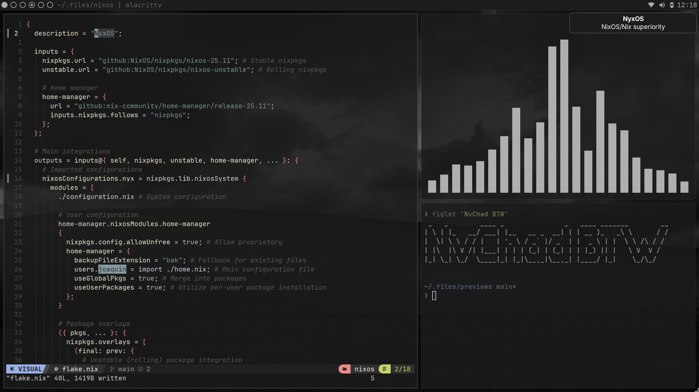
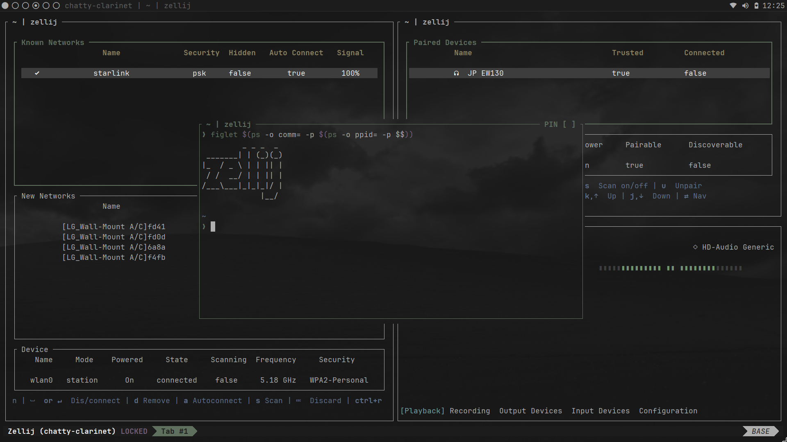
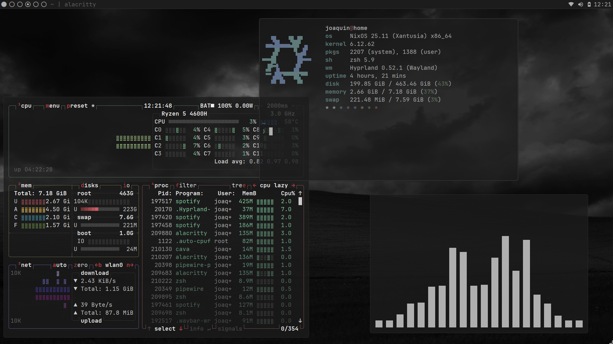
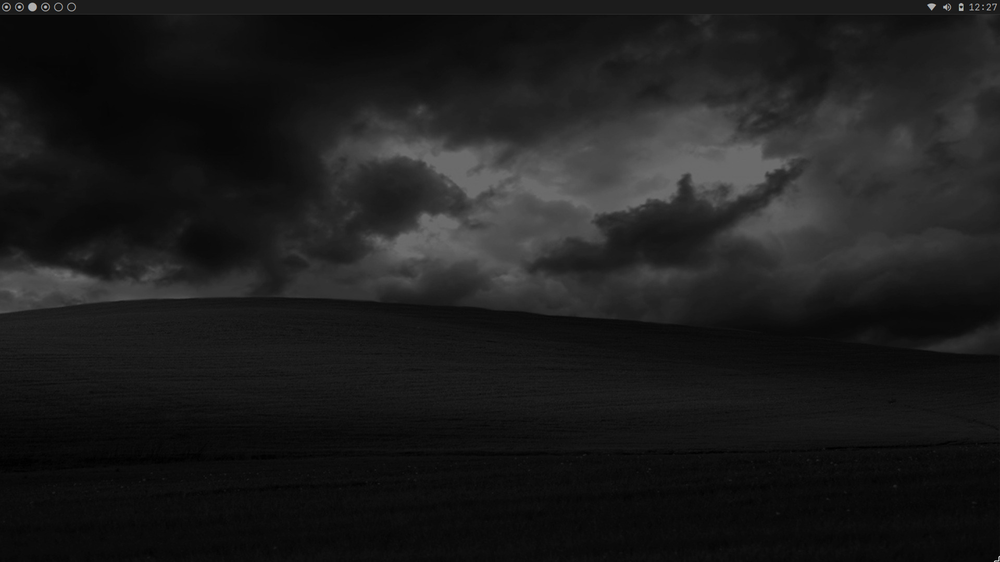
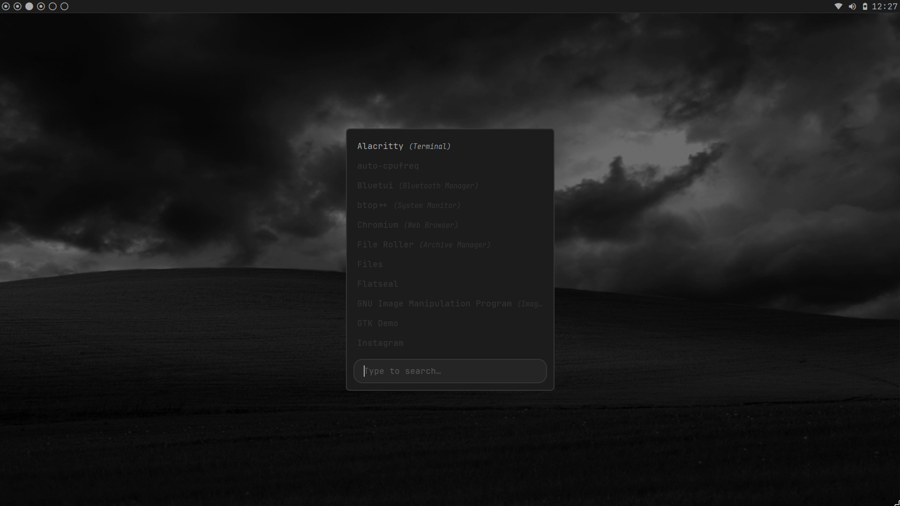

# NyxOS
(Run Super, shift + SPC to open the cheatsheet)

A *modern, extensible* **Hyprland/Wayland** configuration for NixOS with a **striking dark aesthetic** that *doesn't sacrifice vibrant colors*.

NyxOS delivers a sleek, performant desktop environment built entirely with Nix flakes and Home Manager—fully declarative, reproducible, and easy to customize.

# Features
- Lightweight & Performant
Hyprland is tuned to near-maximum efficiency, ensuring the environment stays out of the way of demanding workloads.

- Near-Complete Daily Driver
Includes everything needed for a functional desktop without bloat:
  - Minimal yet powerful Waybar panel
  - Fast app launcher (Rofi/Wofi)
  - Essential utilities (network: impala/wiremix, Bluetooth: bluetui, etc.)
  - Default browser and core apps

- Outstanding Developer Experience
A fully configured dev setup via Home Manager:
  - Neovim with sensible defaults
  - Zsh + fzf + zoxide + useful aliases
  - Zellij terminal multiplexer
  - And more productivity tools out of the box

- Coherent & Declarative Configuration
Almost everything is managed in pure Nix via Home Manager—no scattered config files in multiple languages.

# Installation

Clone the repository: `git clone https://github.com/joaquin-angeles/NyxOS.git && cd NyxOS`

Build and switch to the configuration: `sudo nixos-rebuild switch --flake --impure ./system#nyxos`

# Customization

All system and user configurations are located in flake.nix, system/, and home/ directories. Extending or overriding modules is straightforward thanks to Nix's declarative nature.

# Preview Gallery

### Tiled Layout

### Terminal & TUI Applications

### Floating Windows

### Wallpaper & Aesthetic

### App Launcher

